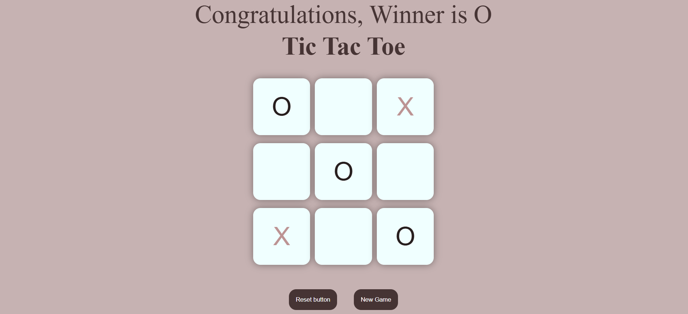

# 🎮 Tic Tac Toe Game

A simple **Tic Tac Toe game** built using **HTML, CSS, and JavaScript**.

This project was created **for fun and learning purposes** while practicing JavaScript and DOM manipulation.

---

## 🖼️ Game Preview

---

## 🚀 Features

- Two-player Tic Tac Toe
- Displays the winner when a player wins
- Reset button to restart the board
- New Game button to start a fresh game
- Clean and responsive UI

---

## 🛠️ Built With

- HTML
- CSS
- JavaScript (DOM manipulation)

---

## 🎯 How the Game Works

1. Player **O** starts the game.
2. Players take turns placing **X** and **O** on the board.
3. The game checks for winning patterns after every move.
4. When a player wins, a **winner message** is displayed.
5. Players can restart using **Reset** or **New Game**.

---

## 📚 What I Learned

While building this project, I practiced:

- JavaScript DOM manipulation
- Event listeners
- Game logic implementation
- CSS layout and styling

---

## 💡 Future Improvements

Some ideas to improve the project:

- Highlight winning boxes
- Add draw detection
- Add simple AI to play against the computer
- Add animations for winning

---

## 🎉 Conclusion

This project was built **just for fun while learning JavaScript**, and it helped me understand how to build small interactive browser games.

